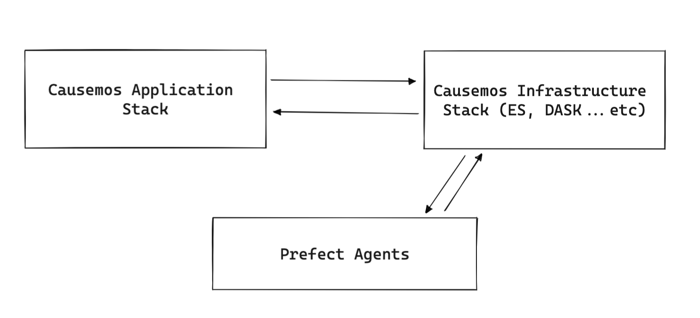

## quickstart
Provide a quick way to run Causemos technology stacks. This will build and run Causemos and related services.



The application side covers these services and more detail about individual services can be found here
- https://github.com/uncharted-causemos/causemos
- https://github.com/uncharted-causemos/wm-go
- https://github.com/uncharted-causemos/wm-curation-recommendation
- https://github.com/uncharted-causemos/slow-tortoise
- https://github.com/uncharted-causemos/anansi
- https://github.com/uncharted-causemos/atlas


### Requirements
- docker version 20+
- python version 3+

### Prerequisite
We need to configure prefect backend and tenant

1. Clone repo and install prefect backend/tenant

```
git clone git@github.com:uncharted-causemos/slow-tortoise.git

cd slow-tortoise

pip install -e .

prefect backend server

prefect server create-tenant --name default --slug default
```


2. Copy the following to ~/.prefect/config.toml

```
[server]
  [server.ui]
    apollo_url="http://localhost:4200/graphql"

[server.telemetry]
  enabled = false

[engine]
    [engine.executor]
    default_class = "prefect.executors.DaskExecutor"
```


### Running infrastructure stack
A docker-compose file is provided here with all the necessary infrastructure for Causemos backend. Note this is quite a heavy stack and may not perform well on a single computer/laptop.

After cloning this repository
```
cd infra

docker-compose up
```

### Infrastructure setup/defaults
After the infrastructure is brought up there are a couple of configurations we need to do:

##### Prefect setup
Go to prefect `http://localhost:8080` and create a new "Production" project

##### Minio setup
Go to minio `http://localhost:9000` and create the following buckets
 - tiles-v3
 - vector-tiles
 - new-models
 - new-indicators


##### ElasticSearch
Create initial mapping schema for ES datastore
```
git clone git@github.com:uncharted-causemos/atlas.git

cd atlas

ES=<elastic_url> python ./es_mapper.py
```

##### Configure geo reference dataset
Download and extract the following geolocation datasets:
- http://download.geonames.org/export/dump/allCountries.zip
- http://clulab.cs.arizona.edu/models/gadm_woredas.txt

Then use anansi utility to load the dataset
```
# 1. Clone or switch over to anansi
git clone git@github.com:uncharted-causemos/anansi.git

# 2. Copy the two data sets to src directory of anansi

# 3. In src, run
ES=<es_url> ES_USER=<user> ES_PASSWORD=<password> python geo_loader.py
```


#### Prefect agent (Models and Indicators)
Agents are used to coordinate data ingestion tasks, there are two agents in Causemos: a dask/docker agent and a sequential agent

Dask/docker agent: In a terminal or tmux session, run the prefect docker agent
```
prefect agent docker start \
  --no-pull \
  --api http://localhost:4200 \
  --label wm-prefect-server.openstack.uncharted.software \
  --network common-net \
  --show-flow-logs \
  --env WM_DASK_SCHEDULER=localhost:8786
```

#### Register data-pipeline task into Prefect/Dask
Copy the following into `register_datapipeline.sh`.
```
#!/bin/bash

# registration process reads this env var to find the prefect server
export PREFECT__SERVER__HOST=http://localhost
export DASK_SCHEDULER=localhost:8786

# set this to true if images should be pushed to the docker registry as part of the
# registration process - not necessary if testing locally
export WM_PUSH_IMAGE=true

PROJECT="Production"

# add calls to register flows here
prefect register --project="$PROJECT" --label wm-prefect-server.openstack.uncharted.software --label docker --path ../flows/data_pipeline.py
```

### Setting up curation/recommendation service (optional)
This is an optional part of Causemos that helps with bulk-curations and CAG building

```
# Clone repo
git@github.com:uncharted-causemos/wm-curation-recommendation.git

# Get SpaCy model
Download from https://spacy.io/models/en then "en_core_web_lg" and extract the tar.gz into the data directory


# Install dependencies
pip install -r requirements.txt
```

Then copy the following into `.env`, ensure ES parameters and NLP_FILE_PATH are correct with respect to your setup

```
ES_URL=http://localhost:9200/
ES_TIMEOUT=120
ES_USERNAME=
ES_PASSWORD=

NLP_FILE_PATH=data/en_core_web_lg-3.0.0/en_core_web_lg/en_core_web_lg-3.0.0

ML_MODEL_DATA_DIR=resources/ml_models/

C_FORCE_ROOT=true
CELERY_BROKER_URL=redis://redis:6379
```

To start the service, use

```
docker-compose up --build
```


### Running the application stack
Make sure the configuration files in `envs` folder are correct and pointing to the right dependencies.

```
cd services
docker-compose up
```
Causemos will be available on `http://localhost:3003`


### Loading knowledge data
Data loaders are in the [anansi repository](https://github.com/uncharted-causemos/anansi).

```
git clone git@github.com:uncharted-causemos/anansi.git
```

Please see the following two scripts for acquiring INDRA and DART datasets from running services. From here on out we will assume these two datasets are available. 
- scripts/build_dart.sh
- scripts/download_indra_s3.py 


To create a knowledge-base we can run the following, for all intents and purposes here SOURCE_* and TARGET_* are the same.

```
#!/usr/bin/env bash

SOURCE_ES=xyz \
SOURCE_USERNAME=xyz \
SOURCE_PASSWORD=xyz \
TARGET_ES=xyz \
TARGET_USERNAME=xyz \
TARGET_PASSWORD=xyz \
DART_DATA=<path_to_dart_cdr.json> \
INDRA_DATASET=<path_to_indra_directory> \
python src/knowledge_pipeline.py
```


### Bring-your-own-data
The bring-your-own-data feature requires installing a Prefect task and agent. This assumes that both DART and INDRA are running as services.


```
git clone git@github.com:uncharted-causemos/anansi.git
```

#### Prefect agent

Create an `incremental.env` file, and populate the values
```
export SOURCE_ES=
export SOURCE_USERNAME=
export SOURCE_PASSWORD=
export TARGET_ES=
export TARGET_USERNAME=
export TARGET_PASSWORD=
export DART_HOST=
export DART_USER=
export DART_PASS=
export INDRA_HOST=
export CURATION_HOST=http://localhost:5000
```

Register the flow with Prefect
```
source incremental.env

PREFECT__ENGINE__EXECUTOR__DEFAULT_CLASS="prefect.executors.LocalExecutor" PYTHONPATH="${PYTHONPATH}:./src" prefect agent local start --api "http://localhost:4200/graphql" --label "non-dask"
```

In a terminal or tmux session, run the prefect docker agent.


#### Registering task
Note: You need to edit `src/incremental_pipeline.py` and change the variable `should_register` to True
```
python incremental_pipeline.py
```


